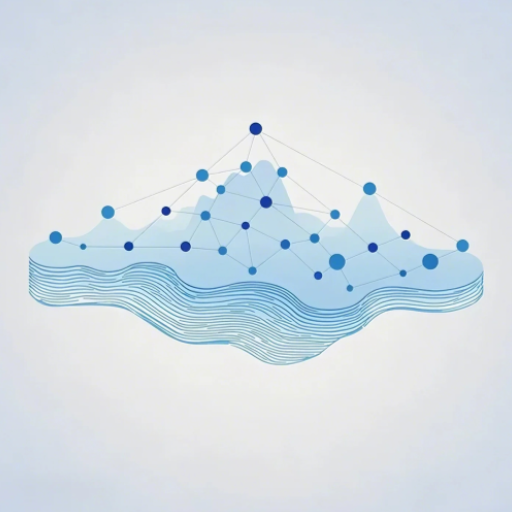

# 零屿笔记官方网站



## 项目概述

零屿笔记官方网站是一个展示零屿笔记应用功能和特点的单页面网站。零屿笔记是一款功能强大的AI驱动智能笔记应用，集成了先进的AI助手、思维导图、知识图谱、手写识别、语音转文本、多模态搜索、无限画布等多种功能，旨在帮助用户从零开始构建个人知识体系，打造专属知识岛屿。

## 网站特点

- 响应式设计，适配各种设备屏幕
- 现代化UI界面，简洁美观
- 流畅的动画和交互效果
- 详细展示产品的各项功能
- 提供下载链接和联系方式

## 技术栈

- HTML5
- CSS3 (动画、过渡效果、Flexbox布局)
- JavaScript (原生JS，无框架依赖)
- SVG图标和插图
- Font Awesome图标库
- Google Fonts字体

## 项目结构

```
零屿笔记官网/
│
├── index.html          # 主页面HTML文件
├── css/                # CSS样式文件夹
│   └── styles.css      # 主样式文件
├── js/                 # JavaScript文件夹
│   └── main.js         # 主交互脚本
├── images/             # 图片资源文件夹
│   ├── logo.svg        # SVG格式logo
│   ├── logo.png        # PNG格式logo
│   ├── hero-app.svg    # 应用界面展示图
│   ├── knowledge-graph.svg  # 知识图谱功能展示
│   ├── mind-map.svg    # 思维导图功能展示
│   └── ...             # 其他功能展示图片
└── README.md           # 项目说明文档
```

## 主要功能展示

网站详细展示了零屿笔记应用的以下核心功能：

1. **智能笔记系统** - 支持Markdown、富文本、纯文本等多种格式
2. **AI助手** - 智能辅助写作、内容总结、问答等功能
3. **思维导图** - 可视化思维组织工具
4. **知识图谱** - 构建知识点之间的关联网络
5. **手写识别** - 基于百度飞桨OCR模型的手写识别功能
6. **语音转文本** - 基于OpenAI Whisper模型的语音识别功能
7. **无限画布** - 自由绘制和组织内容的创意空间
8. **代码识别** - 自动识别和格式化代码片段
9. **多模态搜索** - 支持文本、图像、语音、代码等多种内容的智能搜索
10. **多设备同步与协作** - 跨平台实时同步和多人协作功能
11. **智能标签系统** - AI自动分析笔记内容生成标签建议
12. **数据安全与加密** - 端到端加密保护用户数据

## 交互功能

网站包含以下交互功能：

- 导航栏滚动效果和平滑滚动
- 功能展示区域的轮播图
- 特性卡片的悬停动画效果
- 下载选项的悬停动画效果
- 视差滚动效果
- 鼠标跟随效果
- 滚动显示动画

## 如何使用

1. 克隆或下载本仓库
2. 使用浏览器打开`index.html`文件即可查看网站
3. 也可以将文件部署到任何Web服务器上进行访问

## 浏览器兼容性

- Chrome (推荐)
- Firefox
- Safari
- Edge
- Opera

## 联系方式

- 邮箱：qianxin7274@gmail.com
- 微信公众号：零屿笔记官方微信公众号

## 版权信息

© 2025 零屿笔记团队 版权所有
